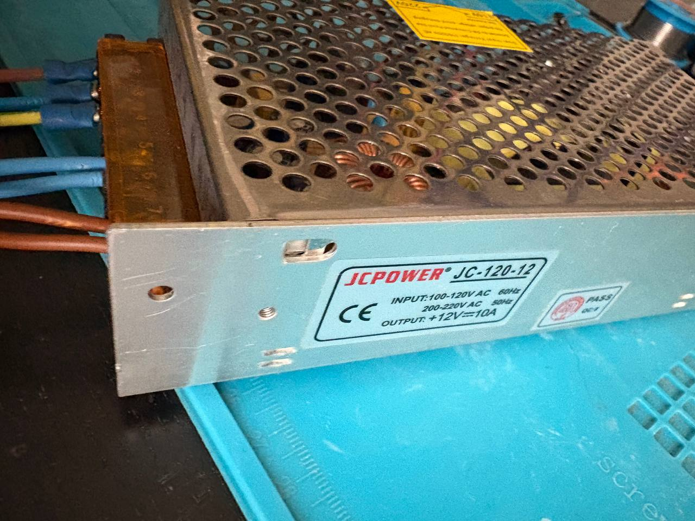
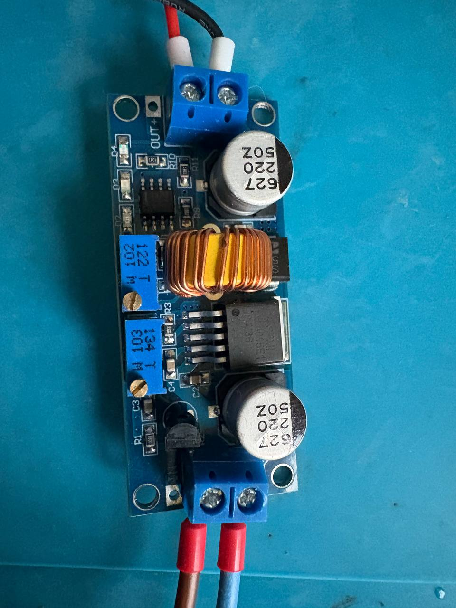
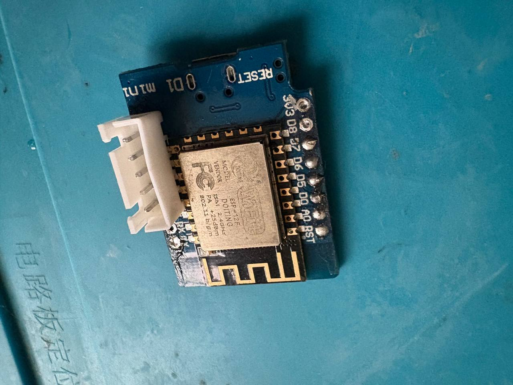
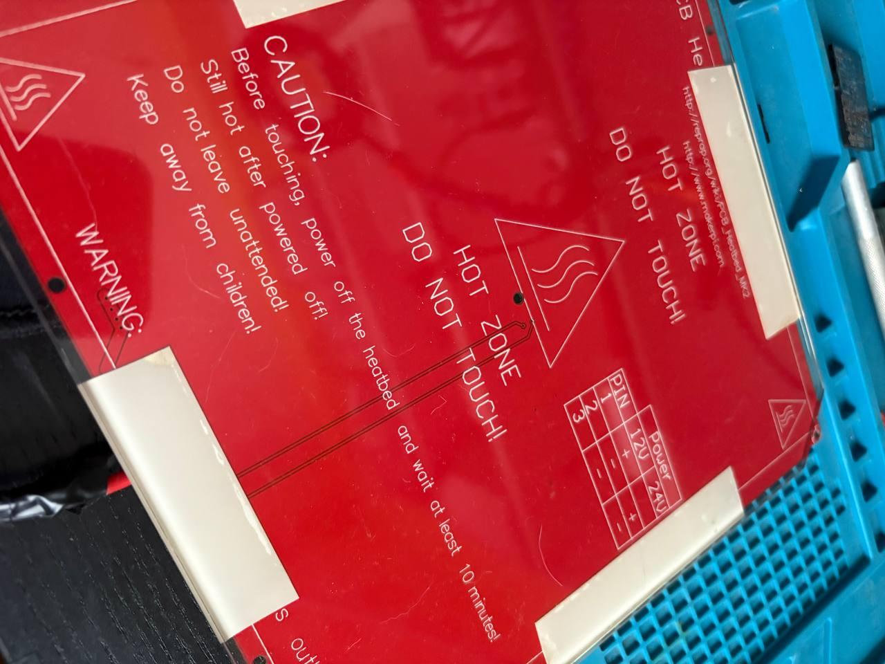

El código debería leer la temperatura de un dallas ds18b20 y compararla con un valor de referencia, en este caso 25ªC.
Si es mayor, apaga el pin de control, si es menor enciende el pin de control.
Conectado a este pin de control habría un relé o mosfet que controla una cama caliente de impresora.

El montaje incluye:
-una fuente de alimentación de 12v 10A para alimentación general.  
  
-un step down o buck converter para alimentar el esp.  
  
-una placa de desarrollo (sirve cualquier arduino-like) [esp12f](https://www.wemos.cc/en/latest/d1/d1_mini_3.1.0.html).  
  
-un mosfet, relé o ssr que funcione a 3v.  
-una cama caliente [RepRap PCB Heatbed MK1](https://reprap.org/wiki/PCB_Heatbed).  
  
